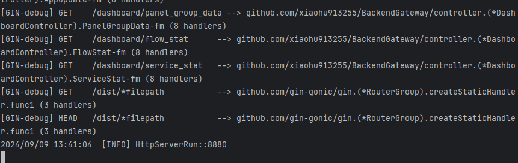
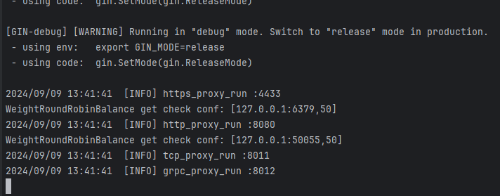

### 运行后端代码

- 首先git clone 本项目
```
git clone git@github.com:xiaohu913255/BackendGateway.git
```
- 确保本地环境安装了Go 1.23+版本

```
go version
go version go1.23.1 darwin/amd64
```

- 下载类库依赖

```
$env:GO111MODULE=on 
$env:GOPROXY=https://goproxy.cn
cd gateway_demo
go mod tidy
```

- 在相应功能文件夹下，执行 `go run main.go` 即可。


### 运行后端项目

- 首先git clone 本项目
```
git clone git@github.com:xiaohu913255/BackendGateway.git
```

- 确保本地环境安装了Go 1.23+版本

```
go version
go version go1.23.1 darwin/amd64
```

- 下载类库依赖

```
$env:GO111MODULE=on 
$env:GOPROXY=https://goproxy.cn
cd gateway_demo
go mod tidy
```

- 创建 db 并导入数据

```
mysql -h localhost -u root -p -e "CREATE DATABASE go_gateway DEFAULT CHARACTER SET utf8 COLLATE utf8_general_ci;"
mysql -h localhost -u root -p go_gateway < go_gateway.sql --default-character-set=utf8
```

- 调整 mysql、redis 配置文件

修改 ./conf/dev/mysql.toml 和 ./conf/dev/redis.toml 为自己的环境配置。

- 运行面板、代理服务

运行管理面板配合前端项目 - 达成服务管理功能
```
go run main.go -config ./conf/dev/ -endpoint dashboard
```


运行代理服务
```
go run main.go -config ./conf/dev/ -endpoint server
```


启动下游服务器
```
go run ./real_server/main.go
```
